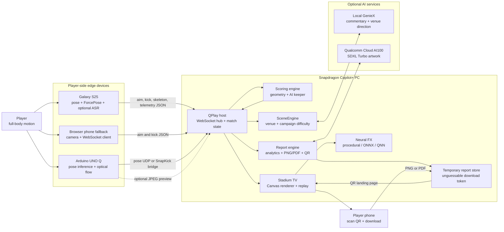
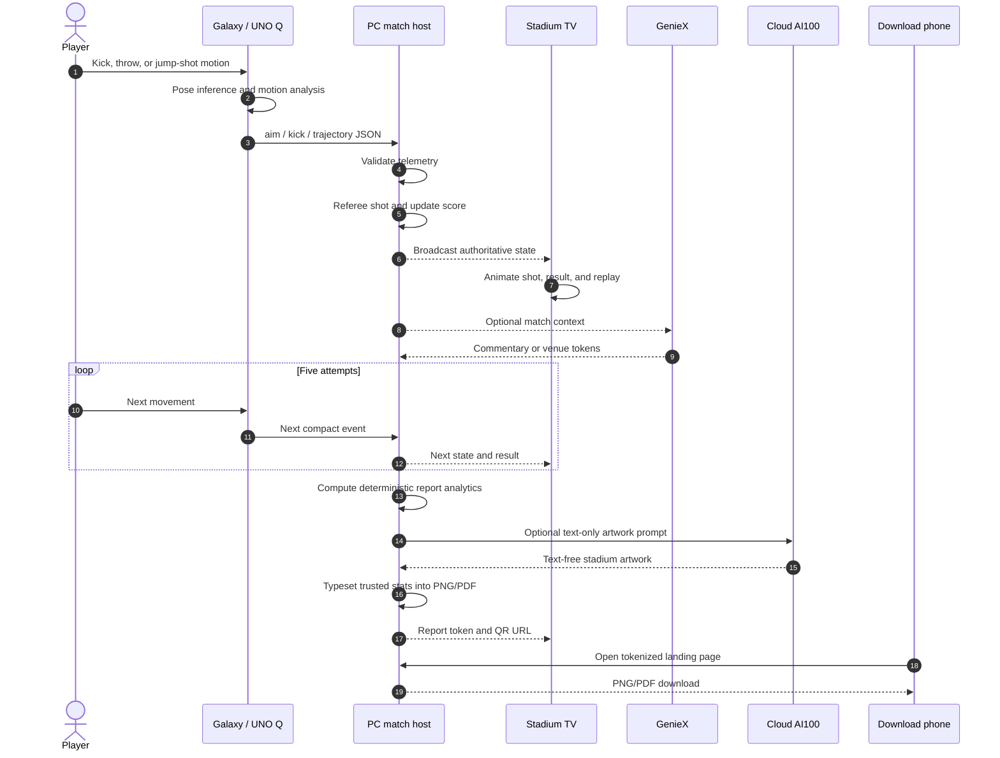
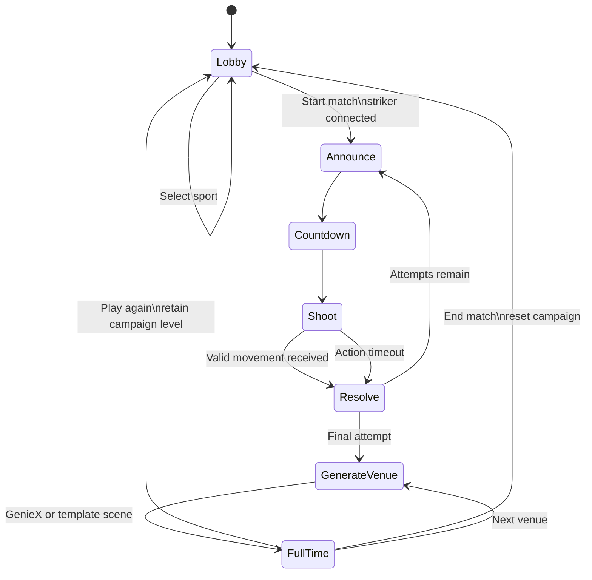
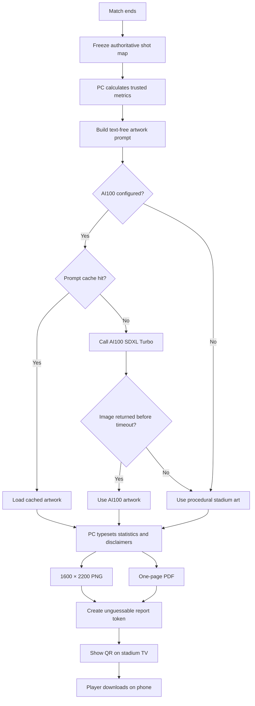
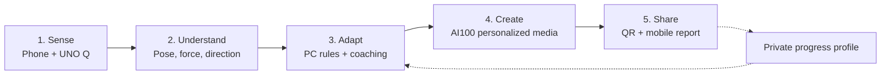
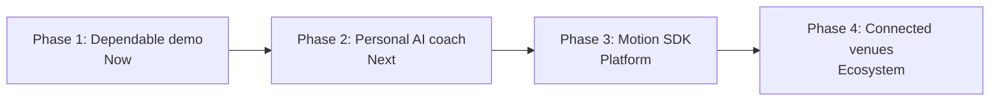

# QPlay (SentinelMesh)

> Gesture-controlled football, darts, and basketball across a Snapdragon Copilot+ PC, Galaxy phone, Arduino UNO Q, and Qualcomm Cloud AI100.

[](https://www.python.org/)
[](#requirements)
[](LICENSE)

QPlay turns a player’s body into the controller for a live, broadcast-style sports game. A phone or Arduino UNO Q observes the player’s movement, converts it into compact pose and shot telemetry, and sends the result to a Copilot+ PC. The PC runs the match, renders the venue, controls the AI goalkeeper, creates replays, and produces a downloadable post-game scorecard. Qualcomm Cloud AI100 can generate the scorecard artwork, with a procedural offline fallback when the cloud is unavailable.

The experience demonstrates useful multi-device intelligence rather than isolated AI features:

- **Galaxy phone:** body pose, kick/throw detection, force estimation, optional local speech and coaching.
- **Arduino UNO Q:** edge pose inference and optional camera relay.
- **Copilot+ PC:** authoritative game state, scoring, AI goalkeeper, broadcast renderer, replays, venue generation, and report hosting.
- **Qualcomm Cloud AI100:** performance-conditioned stadium artwork for post-game reports.
- **Any phone:** scans the final QR code and downloads a PNG or PDF scorecard.

---

## Table of contents

- [Why QPlay](#why-qplay)
- [Key features](#key-features)
- [System architecture](#system-architecture)
- [End-to-end data flow](#end-to-end-data-flow)
- [Game flow](#game-flow)
- [AI100 scorecard flow](#ai100-scorecard-flow)
- [Device responsibilities](#device-responsibilities)
- [Repository structure](#repository-structure)
- [Requirements](#requirements)
- [Quick start](#quick-start)
- [Full setup](#full-setup)
- [How to play](#how-to-play)
- [Sports and scoring](#sports-and-scoring)
- [AI and Snapdragon utilization](#ai-and-snapdragon-utilization)
- [Configuration](#configuration)
- [Protocols and ports](#protocols-and-ports)
- [Post-game reports](#post-game-reports)
- [Privacy and security](#privacy-and-security)
- [Testing](#testing)
- [Demo script](#demo-script)
- [Troubleshooting](#troubleshooting)
- [Known limitations](#known-limitations)
- [Future roadmap](#future-roadmap)
- [Team](#team)
- [License](#license)

---

## Why QPlay

Most motion games either require dedicated controllers or process everything on one machine. QPlay distributes the work according to what each device does best:

1. The device beside the player performs latency-sensitive sensing and pose work.
2. The PC owns deterministic game state, scoring, rendering, and local downloads.
3. Local GenieX can provide commentary and venue direction without sending gameplay to a general cloud LLM.
4. Cloud AI100 performs the optional high-cost image-generation step.
5. The final result returns to the player through a QR code, with no app installation required for downloading.

This makes the multi-device design visible to judges and players: a physical movement begins on an edge device, affects a PC-rendered game, triggers an AI-generated post-game artifact, and returns to the player’s phone.

---

## Key features

- Three games in one TV interface: **football**, **darts**, and **basketball**.
- Full-body movement instead of a handheld controller.
- Galaxy phone or UNO Q as the active striker device.
- Hybrid football referee using metric goal-plane geometry plus an adaptive AI goalkeeper.
- Ring-based darts and basketball scoring.
- Five-attempt matches with countdowns, broadcast graphics, commentary, and replays.
- Force, power, direction, spin, foot, strike type, apex, and trajectory telemetry.
- On-device Neural FX with optional ONNX Runtime/QNN acceleration.
- GenieX-directed campaign venues with deterministic offline templates.
- AI100-assisted post-game scorecards in PNG and PDF formats.
- QR-based report handoff to the player’s phone.
- Offline core gameplay when cloud services are unavailable.
- Browser striker and simulated-kick fallbacks for no-hardware development.

---

## System architecture



### Architectural principle

The PC is authoritative. Edge devices report observations; they do not directly change the displayed score. The host validates incoming fields, resolves the result, updates the state machine, and broadcasts the same state to every connected client.

---

## End-to-end data flow



---

## Game flow



Each match uses the same outer state machine while the referee changes by sport:

- **Football:** goal geometry, post/wide detection, then goalkeeper contest.
- **Darts:** distance from the bull determines ring points.
- **Basketball:** distance from the hoop center determines ring points.

---

## AI100 scorecard flow



AI100 supplies decorative artwork only. All numbers, labels, comparisons, and charts are computed and rendered by deterministic PC code so the image model cannot hallucinate the player’s statistics.

---

## Device responsibilities

| Device | Primary responsibilities | Data sent |
|---|---|---|
| Copilot+ PC | Match authority, referee, AI goalkeeper, TV rendering, replay, telemetry dashboard, SceneEngine, Neural FX, report storage | Optional prompts to configured AI services; report downloads to player |
| Galaxy S25 | Camera capture, pose inference, ForcePose metrics, local calibration, optional Whisper and coach | Compact aim, kick, skeleton, and utilization telemetry |
| Arduino UNO Q | Pose landmarks, optical-flow motion samples, optional camera relay | UDP pose/SnapKick packets; optional JPEG previews |
| Qualcomm Cloud AI100 | Generate text-free stadium art for the scorecard | Generated image response |
| Download phone | Scan QR and save the result | HTTP request containing an unguessable report token |

---

## Repository structure

```text
SentinelMesh/
├── server.py                    # Canonical PC host and match engine
├── public/
│   ├── tv.html                  # Broadcast-style game display
│   ├── phone.html               # Browser striker fallback
│   └── assets/                  # QPlay branding and static media
├── android/                     # Native Galaxy striker application
├── unoq/                        # Arduino UNO Q pose streamer
├── ai100/                       # AI100 report engine and HTTP adapter
├── laptop/                      # Optional SceneEngine assets and experiments
├── classifier/                  # Experimental object-to-sport classifier
├── models/                      # Optional local Neural FX models
├── docs/                        # Protocol and device setup guides
├── tools/                       # Launcher, model fetch, and device helpers
├── scene_engine.py              # Campaign venue generation
├── neural_fx.py                 # Procedural/ONNX/QNN replay effects
├── telemetry_store.py           # Device utilization aggregation
├── geniex_client.py             # Local OpenAI-compatible GenieX client
├── snapkick_bridge.py           # UNO Q SnapKick UDP → WebSocket bridge
├── snapkick_sim.py              # No-hardware kick simulator
├── setup_check/                 # Post-install verification script
├── archive/                     # Superseded documentation revisions
├── start-game.bat               # Windows one-step launcher
├── requirements.txt             # Core PC dependencies
└── LICENSE                      # MIT license
```

> The root `server.py` and `public/` tree are the only match host. The `laptop/` directory retains optional SceneEngine assets and experiments; it is not a second server.

---

## Requirements

### Minimum demo

- Windows 11 PC
- Python 3.13 or newer (the host and its tests are verified on 3.13 and 3.14)
- Microsoft Edge or another current browser
- One motion source:
  - native Android app,
  - browser phone,
  - Arduino UNO Q,
  - or `snapkick_sim.py`

### Intended hackathon hardware

| Role | Recommended device |
|---|---|
| PC host | Snapdragon X Elite Copilot+ PC |
| Mobile striker | Samsung Galaxy S25 series |
| Edge pose | Arduino UNO Q with camera |
| Cloud generation | Qualcomm Cloud AI100 |

### Optional development tools

- JDK 17 and Android SDK for the native app
- `adb` for APK installation and model transfer
- OpenSSL for browser-camera HTTPS certificates
- ONNX Runtime and QNN SDK for accelerated Neural FX
- Qualcomm AI Hub token for optional model export/download
- Local GenieX endpoint for commentary and venue generation

---

## Quick start

### 1. Clone

```powershell
git clone https://github.com/prateeksram/SentinelMesh.git
cd SentinelMesh
```

### 2. Create a Python environment

```powershell
py -3.13 -m venv .venv
.\.venv\Scripts\Activate.ps1
python -m pip install --upgrade pip
python -m pip install -r requirements.txt
```

### 3. Start without UNO Q

```powershell
.\start-game.bat -SkipUnoQ -EnableSnapkickBridge
```

(`-EnableSnapkickBridge` also starts the UDP 5005 bridge the simulator in step 4 talks to.)

Open:

- Stadium TV: `http://localhost:8080/tv.html`
- Browser striker on the same PC: `http://localhost:8080/phone.html`

### 4. Run the no-hardware simulator

In another terminal:

```powershell
.\.venv\Scripts\Activate.ps1
python snapkick_sim.py
```

The TV should show an active striker and enable **START MATCH**.

### 5. Verify the setup (optional)

```powershell
python setup_check\verify_setup.py
```

Boots the host on an ephemeral port and probes its health routes - see [`setup_check/README.md`](setup_check/README.md).

---

## Full setup

### Option A: Galaxy phone

#### Browser fallback

Browser camera access from another device normally requires HTTPS.

Create a development certificate:

```powershell
openssl req -x509 -newkey rsa:2048 -nodes `
  -keyout key.pem -out cert.pem -days 365 `
  -subj "/CN=qplay"
```

Start the host, then open the following URL on the phone and accept the local certificate warning:

```text
https://<PC-LAN-IP>:8443/phone.html
```

#### Native Android app

```powershell
$env:JAVA_HOME = "<path-to-jdk-17>"
$env:ANDROID_HOME = "<path-to-android-sdk>"

cd android
.\gradlew.bat :app:assembleDebug
adb install -r app\build\outputs\apk\debug\app-debug.apk
cd ..
```

In the app, set the host to:

```text
<PC-LAN-IP>:8080
```

Then complete height/weight, T-pose, aiming, and practice calibration.

See [`android/README.md`](android/README.md) and [`docs/README_GalaxyS25.md`](docs/README_GalaxyS25.md).

### Option B: Arduino UNO Q

UNO Q-connected camera mode (default):

```powershell
.\start-game.bat `
  -UnoQIp 192.168.150.72 `
  -SyncUnoQ
```

Laptop-camera relay mode:

```powershell
.\start-game.bat `
  -UnoQIp 192.168.150.72 `
  -CameraMode Laptop `
  -CameraIndex 1
```

Useful flags:

| Flag | Purpose |
|---|---|
| `-UnoQIp <ip>` | UNO Q SSH address |
| `-CameraIndex <n>` | Windows camera index for laptop-camera relay |
| `-CameraMode Laptop` | Relay a PC USB camera to UNO Q |
| `-CameraMode UnoQ` | Read a camera directly on UNO Q |
| `-UnoQDnnTarget cpu\|opencl\|opencl-fp16` | Select the UNO Q OpenCV-DNN target; CPU is the measured default |
| `-SyncUnoQ` | Copy the current streamer to the board before launch |
| `-SkipUnoQ` | Run PC/phone only |
| `-EnableSnapkickBridge` | Enable the SnapKick UDP bridge |

See [`docs/one_step_setup.md`](docs/one_step_setup.md) and [`docs/unoq_pipeline.md`](docs/unoq_pipeline.md).

### Option C: Manual services

Terminal 1:

```powershell
python server.py
```

Terminal 2 - the SnapKick bridge (translates UDP 5005 packets into striker messages):

```powershell
python snapkick_bridge.py --host 127.0.0.1:8080 --udp-port 5005
```

Terminal 3 - a UDP 5005 producer: either point a real UNO Q SnapKick pipeline at the PC, or run the simulator:

```powershell
python snapkick_sim.py
```

---

## How to play

1. Open `tv.html` full-screen on the PC.
2. Select **Football**, **Darts**, or **Basketball** in the lobby.
3. Connect the Galaxy phone, browser striker, UNO Q, or simulator.
4. Position the camera so the player’s full body is visible.
5. Complete calibration when using the native phone app.
6. Select **START MATCH**.
7. Follow the announce and countdown prompts.
8. Aim and perform the sport-specific movement:
   - leg swing for football,
   - hand throw for darts,
   - jump-shot motion for basketball.
9. Complete five attempts.
10. At full time, scan the scorecard QR code if a report is available.
11. Choose **PLAY AGAIN**, **NEXT VENUE**, or **END MATCH**.

---

## Sports and scoring

### Football

The impact is evaluated at an 11 m goal plane against a regulation 7.32 m × 2.44 m frame.

1. Outside the frame becomes **WIDE**.
2. Near the post or crossbar becomes **POST**.
3. On-target shots face **THE WALL**.
4. The goalkeeper considers recent aim and shot history with a reaction delay.
5. Corner placement and high power improve the chance of scoring.

The TV shows goals against saves/non-goals.

### Darts

The target is centered at 1.73 m.

| Distance from center | Points |
|---:|---:|
| ≤ 0.10 m | 100 |
| ≤ 0.30 m | 60 |
| ≤ 0.60 m | 30 |
| ≤ 0.95 m | 10 |
| > 0.95 m | 0 |

### Basketball

The interactive hoop target is centered at 2.0 m.

| Distance from center | Points |
|---:|---:|
| ≤ 0.25 m | 100 |
| ≤ 0.55 m | 40 |
| ≤ 0.95 m | 10 |
| > 0.95 m | 0 |

### Campaign difficulty

| Setting | Football effect | Darts/basketball effect |
|---|---|---|
| `keeperIq` | Improves prediction | — |
| `keeperReaction` | Changes aim-read timing | — |
| `powerBeat` | Raises power needed to beat the glove | — |
| `ringScale` | — | Shrinks target rings as levels rise |
| `shootWindow` | Limits action time | Limits action time |

---

## AI and Snapdragon utilization

### Copilot+ PC

- Runs the real-time match state machine and scoring authority.
- Renders the TV experience at browser frame rate.
- Produces procedural Neural FX for every setup.
- Can use ONNX Runtime and QNN for Depth-Anything-V2-style replay plates.
- Runs or calls local GenieX for commentary and campaign design.
- Composes and serves post-game scorecards.

### Galaxy S25

- Runs full-body pose analysis close to the camera.
- Estimates kick force and kinematic shot properties.
- Can run Whisper ASR and private coaching locally.
- Sends compact gameplay events rather than a continuous phone-camera stream.

### Arduino UNO Q

- Runs edge pose inference and optical-flow motion tracking.
- Produces a generalized pose packet or SnapKick event.
- Can use a directly attached camera or consume a PC camera relay.
- Can send a low-frame-rate preview when preview mode is enabled.

### Qualcomm Cloud AI100

- Runs SDXL Turbo-compatible image generation.
- Receives a text-only, performance-conditioned artwork prompt.
- Does not calculate the player’s statistics.
- Does not need the player’s camera image for the current scorecard workflow.

---

## Configuration

### Match host

| Variable | Default | Meaning |
|---|---:|---|
| `GF_KICKS` | `3` | Attempts per match |
| `GF_SHOOT_WINDOW` | `60` | Base action window in seconds |
| `GF_MIN_SHOOT_WINDOW` | `60` | Minimum action window floor |
| `GF_KEEPER_REACTION` | `0.45` | Seconds of goalkeeper aim-read delay |
| `GF_KEEPER_IQ` | `0.75` | Goalkeeper prediction strength from 0 to 1 |
| `GF_ANNOUNCE_S` | `3.5` | Announce phase duration |
| `GF_COUNTDOWN_S` | `3.0` | Countdown duration |
| `GF_RESOLVE_S` | `3.8` | Result display duration |
| `GF_EDGE_POSE_PORT` | `9999` | Raw UNO Q pose UDP port |
| `GF_EDGE_FRAME_STALE_S` | `2.0` | Maximum camera-preview age |

### GenieX and commentary

| Variable | Default | Meaning |
|---|---|---|
| `GF_GENIEX` | `1` | Set to `0` to disable GenieX |
| `GF_GENIEX_URL` | `http://127.0.0.1:18181/v1` | Local OpenAI-compatible endpoint |
| `GF_GENIEX_MODEL` | `qualcomm/Qwen3-4B-Instruct-2507:W4A16` | Requested GenieX model |
| `GF_SCENE_TIMEOUT_S` | `90` | Venue-generation timeout |
| `GF_SCENE_MAX_LEVEL` | `5` | Campaign level cap |
| `GF_LLM_URL` | unset | Optional fallback commentary endpoint |
| `GF_MODEL` | backend-dependent | Fallback commentary model |
| `ANTHROPIC_API_KEY` | unset | Optional cloud commentary key |

### AI100

Create `ai100/.env` from the template:

```powershell
Copy-Item ai100\.env.example ai100\.env
```

Example:

```dotenv
AI100_BASE_URL=https://aisuite.cirrascale.com/apis/v2
AI100_API_KEY=YOUR_QUALCOMM_KEY
AI100_MODEL=stabilityai/sdxl-turbo
AI100_IMAGE_SIZE=512x512
AI100_TIMEOUT_SECONDS=240

# Optional when QR links must use a tunnel or public origin
GF_PUBLIC_BASE_URL=
```

Install the report dependencies if they are not already installed:

```powershell
python -m pip install -r ai100\requirements.txt
```

> Never commit `ai100/.env`. Add `.env`, `ai100/data/`, and `ai100/cache/` to `.gitignore` before sharing a fresh clone.

---

## Protocols and ports

| Port | Transport | Purpose |
|---:|---|---|
| 8080 | TCP/HTTP | TV, reports, status endpoints, WebSocket upgrade |
| 8443 | TCP/HTTPS | Optional browser-phone camera page |
| 9999 | UDP | Raw UNO Q pose packets |
| 5005 | UDP | SnapKick bridge input |

### WebSocket endpoint

```text
ws://<PC-IP>:8080/ws
```

Representative client messages:

```json
{ "type": "hello", "client": "phone" }
```

```json
{ "type": "aim", "zone": "L" }
```

```json
{
  "type": "kick",
  "zone": "L",
  "power": 0.82,
  "force": 310,
  "dirDeg": 12,
  "height": "H",
  "spin": -0.35,
  "strike": "drive",
  "foot": "R",
  "goalX": -2.6,
  "goalZ": 1.8,
  "apexM": 2.1,
  "speed": 19.4
}
```

Representative server state:

```json
{
  "type": "state",
  "phase": "shoot",
  "sport": "football",
  "kick": 2,
  "kicksTotal": 5,
  "score": 1,
  "saves": 0,
  "timerMs": 58640,
  "connected": {
    "phone": true,
    "unoq": false
  }
}
```

See [`docs/phone_protocol.md`](docs/phone_protocol.md) for the complete schema.

---

## Post-game reports

Each successful report contains:

- goals or hits, conversion rate, and target-sport points;
- maximum and average force;
- power consistency;
- favorite target zone;
- unpredictability and curve index;
- dominant foot and strike mix;
- football-only goalkeeper wrong-foot counts from that match;
- sport-specific AI100 or procedural venue artwork;
- a one-page PNG and PDF;
- a tokenized mobile landing page.

Report URLs use an unguessable token:

```text
/report/<token>
/report/<token>.png
/report/<token>.pdf
/report/<token>/qr.png
```

The TV displays **“Great job! View your scorecard!”**, provides a close button, and dismisses the QR panel automatically after ten seconds.

### Simulate a football report

With the host running:

```powershell
Invoke-RestMethod `
  -Method Post `
  -Uri http://localhost:8080/api/report/simulate `
  -ContentType application/json `
  -Body '{"playerName":"Demo Striker"}'
```

Or generate files directly:

```powershell
python ai100\simulate_report.py --player "Demo Striker"
```

---

## Privacy and security

### Current data behavior

- Native Galaxy pose and camera processing stays on the phone.
- Galaxy gameplay messages contain compact telemetry, not the continuous camera feed.
- UNO Q can send pose packets and, when preview mode is active, low-rate JPEG frames to the PC.
- AI100 receives a text prompt for decorative artwork, not the player’s camera frame in the current report workflow.
- The PC stores scorecard PNG/PDF files locally under `ai100/data/reports/`.
- Download links use random tokens and expire logically after 30 minutes.

### Deployment boundary

The current repository is designed for a **trusted hackathon LAN or private hotspot**. It does not yet provide production-grade authentication for WebSockets, pose UDP, camera preview routes, or every control endpoint.

Before any public deployment:

1. Add a per-session pairing token to the QR code and every WebSocket client.
2. Require role-specific authorization for start, abort, sport, aim, and kick actions.
3. Authenticate camera upload and preview endpoints.
4. Use HTTPS/WSS with a trusted certificate.
5. Bind development-only endpoints to localhost.
6. Add rate and message-size limits.
7. Add periodic deletion for expired report assets.
8. Add `.env`, `ai100/data/`, and `ai100/cache/` to `.gitignore`.

---

## Testing

The full verified test matrix - per-test prerequisites, current statuses, and the Android/UNO Q suites - lives in [`docs/TESTING.md`](docs/TESTING.md).

### Setup smoke check

```powershell
python setup_check\verify_setup.py
```

Checks Python, dependencies, referee geometry, and the host's health routes on an ephemeral port.

### Focused Python tests

```powershell
python -m pytest -q `
  test_referee.py `
  test_unified_edge.py `
  ai100/test_report_engine.py
```

This focused suite currently runs 20 referee, edge-integration, and report tests. UNO Q vision tests additionally require OpenCV.

### AI100 report tests

```powershell
python -m pytest ai100/test_report_engine.py -q
```

### Three-sport integration harness

```powershell
python test_combined.py
```

### Android unit tests

```powershell
cd android
.\gradlew.bat test
```

### Manual acceptance checklist

- [ ] TV loads without console errors.
- [ ] Phone or UNO Q connection enables **START MATCH**.
- [ ] Sport can be changed only in the lobby.
- [ ] Five valid football attempts resolve correctly.
- [ ] Wide and near-post metric shots are classified correctly.
- [ ] Darts ring values match the target table.
- [ ] Basketball ring values match the target table.
- [ ] Browser reconnect does not crash the host.
- [ ] AI100 failure produces procedural football artwork.
- [ ] Scorecard PNG and PDF open from a second phone.
- [ ] QR panel closes manually and after ten seconds.
- [ ] Camera denial, missing edge device, and missing AI key degrade safely.

> The repository-wide `pytest -q` command currently requires cleanup because script-style test modules run network clients during test discovery and duplicate test module names collide. Use the focused command above until the test layout is normalized.

---

## Demo script

### 90-second judge demo

1. **Introduce the system:** “Your body is the controller, but four Snapdragon-class devices share the work.”
2. **Show the phone:** point out live pose, force, and aiming feedback.
3. **Show the TV:** select football and start a three-kick match.
4. **Take one shot:** highlight that the phone sends telemetry while the PC owns scoring and animation.
5. **Show UNO Q:** display pose or utilization status on the TV telemetry rail.
6. **Finish or simulate full time:** show the AI100 report generation status.
7. **Scan the QR:** download the one-page scorecard on a phone.
8. **Finish with orchestration:** “The edge device understood the movement, the PC ran the game, AI100 created the art, and the experience came back to the player’s phone.”

### Offline fallback demo

Disconnect AI100 and GenieX, then demonstrate:

- deterministic scoring;
- template commentary;
- template campaign scene;
- procedural Neural FX;
- procedural scorecard artwork;
- local QR download.

---

## Troubleshooting

| Symptom | Likely cause | Resolution |
|---|---|---|
| `START MATCH` is disabled | No striker role connected | Start the Android app, browser phone, UNO Q bridge, or simulator |
| Phone cannot reach `localhost` | `localhost` points to the phone | Use the PC’s LAN IP, such as `192.168.x.x:8080` |
| Browser phone camera is blocked | Insecure non-local HTTP origin | Use `https://<PC-IP>:8443/phone.html` and accept the development certificate |
| UDP `WinError 10048` | Port 5005 or 9999 is already occupied | Identify the owning process and stop the stale QPlay service |
| Unexpected automatic kicks | `snapkick_sim.py` is still running | Stop the simulator process |
| UNO Q indicator is offline | Wrong host/IP, bridge stopped, or firewall | Verify IPs, ports, SSH, and `/edge/status` |
| Sport buttons do nothing | Match is outside the lobby | End the current match before switching sports |
| AI100 remains “generating” | Cloud request is still inside its timeout | Check the key/model/endpoint and lower `AI100_TIMEOUT_SECONDS` for demos |
| AI100 returns an error | Invalid endpoint, key, model, or provider response | Verify `ai100/.env`; the report should fall back to procedural art |
| QR opens the wrong address | Public/LAN base URL is incorrect | Set `GF_PUBLIC_BASE_URL` to the reachable origin |
| Report URL returns 404 | Token expired or files were removed | Generate a new report |
| Neural FX says procedural | Model/runtime/QNN provider unavailable | Follow `NEURAL_FX.md` or continue with the built-in fallback |

---

## Known limitations

These items describe the current `main` branch and should be resolved before calling the project production-ready:

1. WebSocket roles are self-declared and are not authenticated.
2. Camera preview and edge ingestion routes are intended for a trusted LAN.
3. Generated report/cache directories and `.env` need committed ignore rules.
4. Expired reports become unavailable but physical cleanup is only triggered during later report creation.
5. The default AI100 timeout is 240 seconds, which is too long for many live demos.
6. The default action window floor is 60 seconds, so missed gesture detection can make a match feel stalled.
7. The complete Python test tree is not currently collectable as one clean `pytest` suite.
8. The experimental physical object classifier is not wired into the game host.

---

## Future roadmap

QPlay starts as a gesture-controlled sports game, but its reusable core is a **motion intelligence platform**: edge devices understand physical activity, the PC adapts an experience in real time, and AI100 creates a personalized result that returns to the participant's phone.

### What the future platform looks like



The same pipeline can power many experiences. Only the activity detector, rules, and output template need to change; pairing, telemetry, device health, privacy controls, AI100 generation, and QR delivery remain shared platform services.

### Delivery phases



#### Phase 1 — Dependable demo

- Add QR-paired session tokens and role-based device permissions.
- Add `.env`, `ai100/data/`, and `ai100/cache/` to committed ignore rules.
- Make the complete three-sport E2E harness deterministic and add CI.
- Reduce the AI100 demo timeout and expose retry, cache, and fallback status.
- Add one-command health checks for the PC, phone, UNO Q, GenieX, and AI100.
- Add scheduled report cleanup, structured logs, and camera-route protection.

#### Phase 2 — Personal AI coach

- Create an opt-in player profile that shows improvement across sessions.
- Compare players with their own history before using playful professional benchmarks.
- Detect patterns such as weak-foot accuracy, inconsistent power, or predictable aim.
- Generate personalized practice drills, spoken coaching, and sport-specific AI100 cards.
- Adapt difficulty to player ability and support teams, tournaments, and leaderboards.
- Add explicit consent, retention controls, profile export, and deletion.

#### Phase 3 — Motion Intelligence SDK

- Publish a versioned movement-event schema for kicks, throws, jumps, balance, and custom gestures.
- Provide plug-in interfaces for activity detection, scoring rules, coaching, and report templates.
- Wire object recognition into automatic activity selection.
- Package the PC host as a signed Windows application with guided device setup.
- Allow approved cameras, wearables, and smart equipment to become additional sensing sources.

Representative event:

```json
{
  "activity": "kick",
  "force": 310,
  "speed": 19.4,
  "direction": 12,
  "balance": 0.86,
  "confidence": 0.93
}
```

#### Phase 4 — Connected venues

- Support multiple simultaneous players and team-based stations.
- Connect schools, gyms, stadium booths, and rehabilitation spaces.
- Run opt-in competitions across multiple physical locations.
- Provide privacy-preserving facility dashboards and participation trends.
- Release a developer toolkit for building new motion-controlled experiences.

### Applications beyond the game

| Use case | Participant experience | Device and AI collaboration | Potential value |
|---|---|---|---|
| Sports coaching | Perform kicks, throws, or jumps and receive technique feedback | Phone/UNO Q measures motion; PC analyzes form; AI100 creates the session report | Accessible skill development and progress tracking |
| Physical education | Complete movement challenges, team relays, and class tournaments | Edge devices count movement; PC manages stations; teacher receives summaries | More engaging, measurable PE activities |
| Rehabilitation support | Follow clinician-selected balance and range-of-motion exercises | Local pose tracking measures repetitions and symmetry; PC charts progress | Consistent exercise guidance between appointments |
| Senior mobility | Complete gentle balance, sit-to-stand, and reaction exercises | Edge sensing detects movement quality; PC adjusts difficulty and records trends | Encourages safe, regular movement and early discussion of changes |
| Workplace ergonomics | Practice lifting and receive posture or repetition feedback | Local vision identifies movement patterns; PC provides immediate guidance | Interactive safety training and reduced-risk technique practice |
| Events and fan activations | Scan, pose, kick, or celebrate, then download a personalized poster | PC runs the experience; AI100 generates themed artwork; QR delivers the result | Memorable stadium, conference, retail, and brand experiences |
| Dance and performance | Follow choreography and review timing or group synchronization | Multiple edge cameras estimate poses; PC compares timing; AI100 creates performance art | Practice feedback and shareable event content |
| Accessible control | Map comfortable custom gestures to games or interfaces | Edge device recognizes personalized gestures; PC triggers approved actions | More flexible interaction for people who cannot use standard controllers |
| STEM and AI education | Inspect how one movement travels through a real AI system | Students explore edge inference, networking, game physics, AI100, and privacy | Hands-on teaching for multi-device AI and engineering |
| Remote coaching | Perform a guided session and share selected metrics with a coach | Local devices keep raw video private; PC exports consented summaries | Coaching access without continuously uploading camera video |

### Responsible expansion

- Keep camera processing local by default and transmit only the minimum required telemetry.
- Require explicit consent before saving profiles, sharing results, or using identifiable images.
- Treat rehabilitation, mobility, and safety features as assistive tools—not medical diagnosis—until clinically validated.
- Use authenticated sessions, short retention windows, encrypted transport, and user-controlled deletion.
- Keep AI-generated feedback clearly labeled and base every reported metric on deterministic measurements.

---

## Related documentation

- [`docs/ARCHITECTURE.md`](docs/ARCHITECTURE.md) — components, ports, env vars, routes, message flow
- [`docs/TESTING.md`](docs/TESTING.md) — verified test matrix
- [`docs/one_step_setup.md`](docs/one_step_setup.md) — Windows and UNO Q supervisor
- [`docs/phone_protocol.md`](docs/phone_protocol.md) — WebSocket and UDP message schema
- [`docs/README_GalaxyS25.md`](docs/README_GalaxyS25.md) — Galaxy on-device AI deep dive
- [`docs/unoq_pipeline.md`](docs/unoq_pipeline.md) — UNO Q pose and camera pipeline
- [`docs/trajectory_pipeline.md`](docs/trajectory_pipeline.md) — kick-state → trajectory contract
- [`android/README.md`](android/README.md) — Android build and demo instructions
- [`NEURAL_FX.md`](NEURAL_FX.md) — optional PC Neural FX acceleration
- [`SCENE_ENGINE.md`](SCENE_ENGINE.md) — campaign venue generation
- [`ai100/README.md`](ai100/README.md) — post-game scorecard subsystem
- [`laptop/README.md`](laptop/README.md) — experimental agentic SceneEngine assets
- [`tools/README.md`](tools/README.md) — launcher, model movers, diagnostics
- [`archive/`](archive/) — superseded documentation revisions

---

## References

- [ForcePose paper](https://arxiv.org/abs/2503.22363)
- [Qualcomm AI Hub](https://aihub.qualcomm.com/)
- [Qualcomm Cloud AI SDK](https://www.qualcomm.com/developer/cloud-ai-sdk/overview)
- [Arduino UNO Q documentation](https://docs.arduino.cc/hardware/uno-q/)
- [ONNX Runtime QNN execution provider](https://onnxruntime.ai/docs/execution-providers/QNN-ExecutionProvider.html)

---

## Team

**Team:** The Child in Us

| Name | Email |
|---|---|
| Prateek Shantharama | prateeksram@gmail.com |
| Benaka Surya T Y | |
| Anvisha Saxena | |
| Parth Shinde | |
| Ananya Bhargavi Kodali | |

---

## License

Released under the [MIT License](LICENSE).

Copyright © 2026 prateeksram and contributors.
