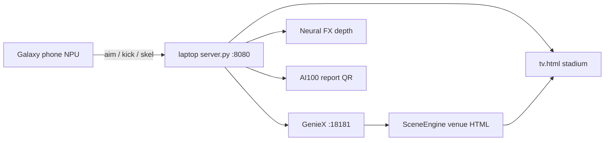

# Gesture Football — End-to-End Guide

Body-controlled penalty shootout on Snapdragon silicon.

**Hand aims. Leg kicks. ForcePose measures Newtons on-device. Whisper hears you. A private coach talks back — no camera video leaves the phone.** The laptop runs the match, THE WALL (AI keeper), the TV stadium, on-device GenieX venue generation, and the AI100 post-match scouting report.

This document is the full path from zero → first goal → next venue → scouting QR.

---

## What you are building

| Role | Device | Responsibility |
|---|---|---|
| **Player 1** | Android phone (`android/`) | Pose, ForcePose, Whisper, private coach, aim/kick JSON |
| **Host / TV** | Laptop (`laptop/server.py` + `tv.html`) | Match engine, keeper, stadium UI, SceneEngine, AI100 report |
| **On-device LLM (laptop)** | GenieX Qwen3-4B | Desk commentary + agentic next-venue TV skins |
| **Cloud (optional)** | Qualcomm AI100 SDXL | Report artwork only (not HTML, not scores) |

**Privacy rule:** camera frames stay on the phone. The wire is tiny JSON over WebSocket (`aim`, `kick`, `skel`).



---

## Prerequisites

| Need | Notes |
|---|---|
| Windows laptop (Snapdragon X Elite recommended) | Host + GenieX |
| Python 3.10+ (ARM64 OK) | `pip install -r requirements.txt` |
| Same Wi‑Fi / hotspot as the phone | LAN only — match does not need internet |
| Android phone (Galaxy S25 Ultra target) | Native app, not browser |
| Optional: GenieX CLI | Desk + SceneEngine quality |
| Optional: `AI100_API_KEY` | Cloud report art; procedural fallback works |
| Optional: JDK 17 + Android SDK | Rebuild APK |

---

## One-time setup

### 1. Clone and Python deps

```powershell
cd C:\Users\qc_de\SentinelMesh
python -m pip install -r requirements.txt
# Optional Neural FX ONNX:
# python -m pip install onnxruntime
```

### 2. AI100 report key (optional)

```powershell
Copy-Item ai100\.env.example ai100\.env
# Edit ai100\.env → set AI100_API_KEY
```

Without a key, reports still generate with procedural artwork and a QR.

### 3. GenieX (laptop LLM)

```powershell
$env:QAI_HUB_API_TOKEN = "<your AI Hub token>"   # never commit
.\laptop\fetch_aihub_models.ps1
geniex pull ai-hub-models/Qwen3-4B-Instruct-2507
geniex serve
# OpenAI-compatible API: http://127.0.0.1:18181/v1
# Model id: qualcomm/Qwen3-4B-Instruct-2507:W4A16
```

If GenieX is down, Desk and SceneEngine fall back to templates — the match still runs.

### 4. Laptop depth model (optional Neural FX)

`fetch_aihub_models.ps1` also places depth ONNX under `laptop/models/`. Missing model → procedural hero plates only.

### 5. Android APK

```powershell
# Set JAVA_HOME / ANDROID_HOME for your machine
cd android
.\gradlew.bat :app:assembleDebug
adb install -r app\build\outputs\apk\debug\app-debug.apk
```

**On-device models**

| Model | How |
|---|---|
| Pose landmark (NPU) | Bundled in APK `assets/npu/` |
| Whisper Tiny | `.\tools\push_whisper_models.ps1` → app `files/whisper/` |
| Qwen coach (optional) | `.\tools\push_qwen_models.ps1 -Source <folder>` |

### 6. TLS certs (browser `phone.html` only)

Native app uses plain `ws://…:8080` — **no certs**. For Chrome camera on LAN:

```powershell
cd laptop
openssl req -x509 -newkey rsa:2048 -nodes -keyout key.pem -out cert.pem -days 365 -subj "/CN=gesture-football"
```

Server then also serves HTTPS on **8443**.

---

## Run a full match (startup order)

### Terminal A — GenieX (optional but recommended)

```powershell
geniex serve
```

### Terminal B — laptop host

```powershell
cd C:\Users\qc_de\SentinelMesh\laptop
python server.py
```

Expected console lines:

- `HTTP : http://0.0.0.0:8080`
- Desk / FX / Scene readiness

### TV browser

Open **`http://localhost:8080/tv.html`**  
Debug scene HUD: **`http://localhost:8080/tv.html?debug=1`**

### Phone

1. Same Wi‑Fi as the laptop.
2. Note laptop LAN IP (`ipconfig`) — e.g. `10.73.51.224`.
3. Open **Gesture Football** → HOST = `10.73.51.224:8080` → tap **HOST**.
4. TV **PHONE** LED turns green.
5. Calibrate once if prompted → step back until **FULL BODY ✓**.
6. On TV → **START MATCH**.

**Do not** put `localhost` in the phone HOST field unless the server is on the phone.

---

## Default ports and URLs

| Service | URL |
|---|---|
| TV / static / APIs | `http://localhost:8080/` → `/tv.html` |
| WebSocket | `ws://<lan-ip>:8080/ws` |
| Optional HTTPS | `https://<lan-ip>:8443/` |
| GenieX | `http://127.0.0.1:18181/v1` |
| Hardware status | `GET /hw/status` |
| Neural FX status | `GET /fx/status` |
| Scene status | `GET /scene/status` |
| Scene brief (export) | `GET /scene/brief` |
| Scene upload | `POST /scene/upload` |

---

## How a match works

### Phases

```
lobby → announce → countdown → shoot → resolve
  ↑__________________________________|
         × kicks (default 5)
                ↓
         generating  (SceneEngine + progress bar)
                ↓
              end  (NEXT VENUE + AI100 report QR)
```

| Phase | What happens |
|---|---|
| **lobby** | Wait for phone + START |
| **announce** | Kick N/5; aim freely; Desk line |
| **countdown** | Feint window — switch corners late |
| **shoot** | **Aim locks**; swing when ready |
| **resolve** | Goal / save / post / miss + hero FX |
| **generating** | Progress bar shows exact GenieX/pipeline steps |
| **end** | Score, next-venue skin, scouting report QR |

### Aim lock

- Live aim streams only in **announce** / **countdown**.
- When **shoot** starts, phone + server freeze the corner.
- Feints after the whistle no longer change the shot.

### How to play

- **Aim** — raised hand → L / C / R (or say left / right / center)
- **Kick** — leg swing on **KICK!** · ~380 N ≈ full power
- **Feint** — fake a corner, switch late, then swing (before shoot lock)
- **Voice** — “ready”, trash-talk → private TTS coach on phone

### Campaign levels

After full time, SceneEngine picks the next venue level from score (never regresses on rematch). Higher levels → harder keeper knobs (`keeperIq`, shorter `shootWindow`, etc.). **NEXT VENUE** keeps campaign state; **END MATCH** / abort resets to lobby level 1.

---

## Agentic TV venue generation (SceneEngine)

Golden file [`laptop/public/tv.html`](laptop/public/tv.html) is the **functional contract** forever.

After each match:

1. Load golden contract + learning memory  
2. GenieX **Director** drafts CSS + overlay + difficulty JSON  
3. Assemble a full candidate HTML from golden + skin  
4. **Verify** required IDs / WebSocket / `onState` / `applyScene`  
5. On fail → record lesson → **Critic** reframe (max 3 attempts)  
6. **Promote** to `/scenes/live/level_N.html` or template fallback  
7. TV injects skin (and may navigate to the live page)

Progress labels on TV (`genStep`), e.g.:

- Loading golden TV contract…  
- Director drafting venue HTML (attempt 1/3)…  
- Validating candidate against golden contract…  
- Promoting verified TV page… / Fallback to golden TV  

**Human polish loop**

```powershell
Invoke-RestMethod http://localhost:8080/scene/brief
# Edit CSS/HTML elsewhere, then:
Invoke-RestMethod -Method Post http://localhost:8080/scene/upload `
  -ContentType application/json `
  -Body '{"level":3,"css":"body{filter:saturate(1.2)}","overlayHtml":"<div id=\"venueTitleCard\">Night Derby</div>"}'
```

Upload must pass the same golden verifier before promote.

Details: [`laptop/SCENE_ENGINE.md`](laptop/SCENE_ENGINE.md)

---

## Four laptop AI pillars

| Pillar | Module | Job |
|---|---|---|
| **Desk** | GenieX via `geniex_client.py` | Spoken/ticker commentary |
| **Neural FX** | `neural_fx.py` + TV Canvas | Kick hero plates (depth ONNX or procedural) |
| **SceneEngine** | `scene_engine.py` + `scene_contract.py` | Next venue HTML + difficulty |
| **AI100 report** | `ai100/` | PNG/PDF scouting card + QR |

Desk waits until SceneEngine finishes so GenieX NPU is not contended.

---

## Post-match AI100 report

At `end`, the laptop builds a private scouting card from the existing `shotmap` (no extra phone upload):

- conversion, ForcePose Newtons, placement, chip/drive, foot, feint rate  
- Ronaldo / Messi sample comparison (clearly labeled)  
- AI100 SDXL artwork **or** procedural art  
- TV QR → landing / PNG / PDF (unguessable token, ~30 min expiry)

Simulate without playing:

```powershell
Invoke-RestMethod -Method Post http://localhost:8080/api/report/simulate `
  -ContentType application/json -Body '{"playerName":"Demo Striker"}'
# or:
python ai100\simulate_report.py --player "Demo Striker"
```

Details: [`ai100/README.md`](ai100/README.md)

---

## Phone stack (Player 1)

| Capability | Implementation |
|---|---|
| Sees you | CameraX + Hexagon NPU pose (tap **DELEGATE**: NPU → GPU → CPU) |
| Knows you | One-time calibration → `player_profile.json` on device only |
| Measures you | ForcePose (Savitzky–Golay → torso metres → F = m × a) |
| Hears you | Whisper Tiny on Hexagon (pushed models) |
| Talks back | TTS + private coach (grounded; optional on-device Qwen) |

Protocol: [`docs/phone_protocol.md`](docs/phone_protocol.md)  
Deep dive: [`README_GalaxyS25.md`](README_GalaxyS25.md) · [`android/README.md`](android/README.md)

### Pitch line

*Snapdragon hears you, measures your kick in Newtons, coaches you privately, and only sends a tiny JSON shot to the TV.*

---

## Environment knobs

| Variable | Default | Meaning |
|---|---|---|
| `GF_KICKS` | `5` | Kicks per match |
| `GF_SHOOT_WINDOW` | `0` | ≤0 = wait forever for kick; scenes may override |
| `GF_KEEPER_REACTION` | `0.45` | Feint window (s) before kick |
| `GF_KEEPER_IQ` | `0.75` | Base keeper skill |
| `GF_ANNOUNCE_S` | `3.5` | Announce duration |
| `GF_COUNTDOWN_S` | `3.0` | Countdown |
| `GF_RESOLVE_S` | `3.8` | Resolve / replay |
| `GF_GENIEX` | `1` | Desk uses GenieX |
| `GF_GENIEX_URL` | `http://127.0.0.1:18181/v1` | GenieX base |
| `GF_GENIEX_MODEL` | `qualcomm/Qwen3-4B-Instruct-2507:W4A16` | Model id |
| `GF_SCENE_TIMEOUT_S` | `90` | Director/critic timeout |
| `GF_SCENE_MAX_LEVEL` | `5` | Campaign cap |
| `GF_SCENE_MAX_ATTEMPTS` | `3` | Gen → verify retries |
| `GF_PUBLIC_BASE_URL` | auto LAN | QR origin (use ngrok HTTPS for off-LAN) |
| `GF_ENABLE_REPORT_SIM` | `0` | Allow simulate endpoint remotely |
| `AI100_API_KEY` | in `ai100/.env` | Cloud artwork |

Fast pacing for development:

```powershell
$env:GF_ANNOUNCE_S="0.1"; $env:GF_COUNTDOWN_S="0.2"
$env:GF_SHOOT_WINDOW="1.0"; $env:GF_RESOLVE_S="0.1"
python laptop\server.py
```

---

## Verification / smoke tests

```powershell
# With server running (and GenieX if you want live Desk):
cd laptop
python e2e_sim.py          # full phone/TV simulation + report asserts
python debug_scene.py      # agentic venue gen · two levels · contract check
python test_scene_gen.py
python test_scene_upload.py
python test_match.py

cd ..
python -m pytest ai100\test_report_engine.py -q
```

---

## Troubleshooting

| Symptom | Fix |
|---|---|
| TV **PHONE** red | HOST = laptop **LAN** IP + same Wi‑Fi; tap HOST |
| START greyed out | Phone WebSocket not connected |
| HOLD LIKE A MIRROR | Step back — shoulders **and** ankles visible |
| `VOICE · NO MODEL` | `.\tools\push_whisper_models.ps1` → force-stop app → relaunch |
| Auto-kick / timeout | Ensure `GF_SHOOT_WINDOW=0` (or unset) for wait-forever |
| Scene looks identical | Open `tv.html?debug=1`; check `/scene/status` fingerprint + `genStep` |
| GenieX / SCENE · TEMPLATE | Start `geniex serve`; check `/hw/status` |
| Report stuck generating | Check `ai100/.env`; procedural art still works without key |
| QR blank off-LAN | Set `GF_PUBLIC_BASE_URL` to ngrok HTTPS origin |
| Aim drifts mid-kick | Rebuild phone APK (aim lock); server also freezes on shoot |
| CAMERA BLOCKED (browser) | Use native app, or HTTPS `:8443` for `phone.html` |

---

## Repo map

| Path | Purpose |
|---|---|
| [`laptop/server.py`](laptop/server.py) | Match host, WS hub, Desk, Scene, FX, reports |
| [`laptop/public/tv.html`](laptop/public/tv.html) | Golden TV UI |
| [`laptop/scene_engine.py`](laptop/scene_engine.py) | Agentic venue generation |
| [`laptop/scene_contract.py`](laptop/scene_contract.py) | Golden functional verifier |
| [`laptop/neural_fx.py`](laptop/neural_fx.py) | Hero depth / procedural FX |
| [`laptop/geniex_client.py`](laptop/geniex_client.py) | Shared GenieX client |
| [`ai100/`](ai100/) | Post-match report engine |
| [`android/`](android/) | Player 1 native app |
| [`docs/phone_protocol.md`](docs/phone_protocol.md) | Wire protocol |
| [`laptop/SCENE_ENGINE.md`](laptop/SCENE_ENGINE.md) | Venue generation deep dive |
| [`laptop/NEURAL_FX.md`](laptop/NEURAL_FX.md) | Stadium FX deep dive |
| [`README_GalaxyS25.md`](README_GalaxyS25.md) | Phone-side technical README |

---

## 90-second demo beat

1. Tap **DELEGATE** — NPU / GPU / CPU latency changes  
2. Calibration — profile never leaves this Snapdragon  
3. Full-body kick — ForcePose Newtons on TV  
4. Say “ready” — Whisper on Hexagon  
5. Feint in countdown, swing after aim lock  
6. Full time — watch **genStep** progress → new venue look  
7. Scan AI100 report QR  

---

## Stretch (not required for demo)

| Item | Notes |
|---|---|
| Full GenieX Qwen on phone NPU | Coach works offline today |
| IMU kick failover | Cover lens, still score |
| Arduino UNO Q Player 2 | Same WebSocket protocol |
| Headless Playwright smoke on candidates | Static contract ships today |
